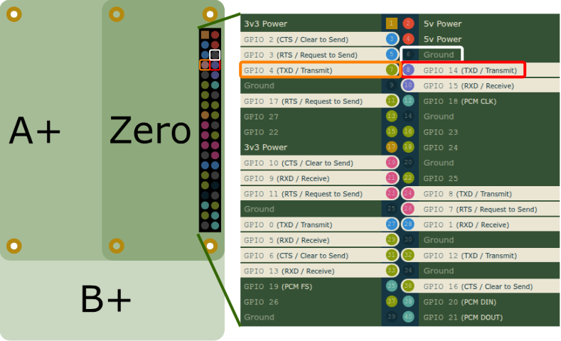
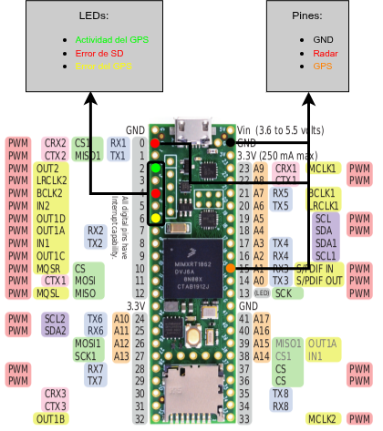

# TFM Firmware Teensy — Estimación de lámina de agua (Albufera)

Firmware para Teensy 4.1 encargado de la adquisición sincronizada de datos
del radar altimétrico Ainstein US-D1 (UART, 100 Hz) y del receptor GNSS
Holybro H-RTK ZED-F9P (UBX, PPK), en el marco del TFM de estimación de
lámina de agua en arrozales de la Albufera mediante UAV.

## Repositorios relacionados

- Emulador HIL (Raspberry Pi 4): [albertojroma/Emulador_RPi4](https://github.com/albertojroma/Emulador_RPi4)
  — Emula ambos sensores para validar este firmware sin hardware físico.

## Estructura

- `src/` — Código fuente (FSM, parsers de radar y GPS, logging SD)
- `include/` — Cabeceras compartidas
- `lib/` — Librerías propias del proyecto
- `test/` — Tests unitarios (PlatformIO Unit Testing)

## Entorno

- Plataforma: Teensy 4.1
- Framework: Arduino (vía PlatformIO)

## Generación de documentación técnica (Doxygen)

Para regenerar la documentación del código:

```
cd docs
doxygen Doxyfile
```

La documentación se genera en `docs/html/index.html`.

## Conexiones con el emulador

Para que todo funcione correctamente con el emulador se deben realizar las
conexiones de acuerdo a las imágenes inferior donde:
* El TX del emulador del radar (PIN 8 en la RPi4) se conecta al **PIN 0** de la Teensy 4.1.
* El RX del emulador del GPS (PIN 7 en la RPi4) se conecta al **PIN 15** de la Teensy 4.1.

| Pinout RPi4 | Pinout Teensy |
|-------------|---------------|
|  |  |